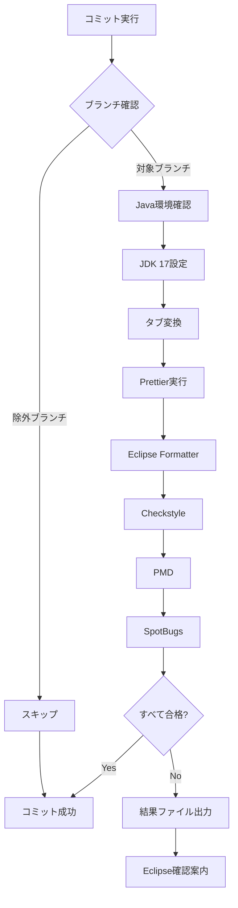

# Java開発者のための静的解析とプリコミットフックの仕組み一式

## 概要

EclipseとIntelliJ IDEAの両方に対応した、JDK 17ベースのJava開発者のための静的解析とプリコミットフックの仕組みです。  
pre-commitフックを使用して、コミット時に自動的にコードフォーマットと品質チェックを実行します。  

## システム構成

### 対象ファイル一覧

```
./
├── format-and-check.sh              # 統合フォーマット・静的解析メインスクリプト
├── pom.xml                          # Maven設定（静的解析プラグイン設定）
├── checkstyle-simple.xml            # Checkstyle設定
├── pmd-rules-simple.xml             # PMD設定
├── eclipse-format.xml               # Eclipse Formatter設定
├── .prettierrc                      # Prettier設定
└── package.json                     # Node.js設定

scripts/
├── setup-pre-commit-hook.sh         # pre-commitフック自動セットアップ
└── hooks/
    └── pre-commit                   # 元のpre-commitフック（参考用）

PRE-COMMIT-GUIDE.md                   # Eclipse用操作ガイド
pre-commit-result.txt                 # 実行結果ファイル（自動生成）
```

## 主要機能

### 1. 統合フォーマット
- **タブインデント統合**: スペース→タブ自動変換
- **Prettier Java**: Node.js + prettier-plugin-java
- **Eclipse Formatter**: eclipse-format.xml

### 2. 静的解析
- **Checkstyle**: コーディング規約チェック
- **PMD**: 品質問題検出
- **SpotBugs**: バグパターン検出

### 3. Eclipse対応機能
- **pre-commit-result.txt**: Eclipse Package Explorerで確認可能な結果ファイル
- **ブランチ除外**: main, master, develop, release/*, hotfix/*
- **JDK 17環境強制**: プロジェクト要件に合わせた環境設定

## セットアップ手順

### 1. 基本セットアップ
```bash
# プロジェクトルートで実行
./scripts/setup-pre-commit-hook.sh
```

### 2. Eclipse設定
```
Eclipse → Preferences → Java → Code Style → Formatter
→ Import → eclipse-format.xml を選択
```

### 3. JDK 17確認
```bash
java -version
# openjdk version "17.0.x" であることを確認
```

## 技術的特徴

### JDK 17環境強制
- 複数JDKベンダー対応（Amazon Corretto, Eclipse Temurin, Oracle JDK等）
- Maven実行時にJAVA_HOME明示的設定
- SpotBugsのJava 21クラスファイル互換性問題回避

### Eclipse IDE連携
- Package Explorerでの結果確認
- 無言ダイアログ問題の解決
- ターミナル操作不要のワークフロー

### 柔軟なエラーハンドリング
- 静的解析ツール個別の失敗を適切に処理
- Maven/Node.js環境の自動検出
- わかりやすいエラーメッセージとガイダンス

## 設定ファイルの詳細

### format-and-check.sh
統合フォーマット・静的解析のメインスクリプト。JDK 17環境の自動設定とEclipse対応を含む。

### setup-pre-commit-hook.sh
pre-commitフックの自動セットアップとEclipse用ガイドファイル生成。

### PRE-COMMIT-GUIDE.md
Eclipse開発者向けの詳細な操作ガイドとトラブルシューティング。

## 実行フロー



## Eclipse での確認方法

1. **コミット失敗時**
   - Package Explorerで `pre-commit-result.txt` をダブルクリック
   - 詳細な実行ログとエラー内容を確認

2. **手動実行**
   ```bash
   cd .
   ./format-and-check.sh
   ```

3. **トラブルシューティング**
   - `PRE-COMMIT-GUIDE.md` を参照
   - Java環境、Maven設定の確認手順

## 運用上の利点

### 開発者エクスペリエンス
- Eclipse IDEから出ることなく静的解析結果を確認
- ターミナル操作スキル不要
- わかりやすいエラーメッセージ

### チーム開発
- 統一されたコード品質基準
- IDE選択の自由度（Eclipse/IntelliJ対応）
- 自動化されたpre-commit品質ゲート

### 保守性
- 設定ファイルの一元管理
- トラブルシューティングガイド完備
- 段階的な機能拡張が可能

---

この仕掛けを各Projectに適用する事により、Javaプロジェクトでの静的解析とコードフォーマットが自動化され、特にEclipse IDEを使用する開発者にとって使いやすい開発環境が構築されます。
