# 静的解析システム 包括的動作フローシーケンス図

## 概要
プロジェクトにおけるEclipse + IntelliJ IDEA対応の統合静的解析システムの詳細な動作フローを表現したシーケンス図です。JDK 17環境強制、Eclipse IDE連携、pre-commitフックのすべてのフローを網羅しています。

**🎨 2025年6月19日更新**: JDK 17環境強制対応、Eclipse Package Explorer連携、SpotBugs互換性問題対応

## 目次
- [静的解析システム 包括的動作フローシーケンス図](#静的解析システム-包括的動作フローシーケンス図)
  - [概要](#概要)
  - [目次](#目次)
  - [1. Pre-commitフック実行フロー（Eclipse対応）](#1-pre-commitフック実行フローeclipse対応)
  - [2. 統合フォーマット・静的解析フロー（format-and-check.sh）](#2-統合フォーマット静的解析フローformat-and-checksh)
  - [3. JDK 17環境強制設定フロー](#3-jdk-17環境強制設定フロー)
  - [4. Eclipse IDE連携フロー](#4-eclipse-ide連携フロー)
  - [5. SpotBugs互換性問題対応フロー](#5-spotbugs互換性問題対応フロー)
  - [6. ブランチ除外フロー](#6-ブランチ除外フロー)
  - [7. エラーハンドリング・リカバリーフロー](#7-エラーハンドリングリカバリーフロー)
  - [まとめ](#まとめ)
    - [主要なフロー](#主要なフロー)
    - [検出される品質問題](#検出される品質問題)
    - [次のステップ](#次のステップ)
  - [3. CI/CD自動実行フロー（GitHub Actions）](#3-cicd自動実行フローgithub-actions)
  - [3. Pre-commitフック実行フロー](#3-pre-commitフック実行フロー)
  - [4. GitHub Actions CI/CDフロー](#4-github-actions-cicdフロー)
  - [5. 統合テストフロー（comprehensive-integration-test.sh）](#5-統合テストフローcomprehensive-integration-testsh)
  - [6. エラーハンドリングフロー](#6-エラーハンドリングフロー)
  - [7. ツール間連携フロー](#7-ツール間連携フロー)
  - [まとめ](#まとめ-1)
    - [主要なフロー](#主要なフロー-1)
    - [検出される品質問題](#検出される品質問題-1)
    - [次のステップ](#次のステップ-1)

## 1. Pre-commitフック実行フロー（Eclipse対応）

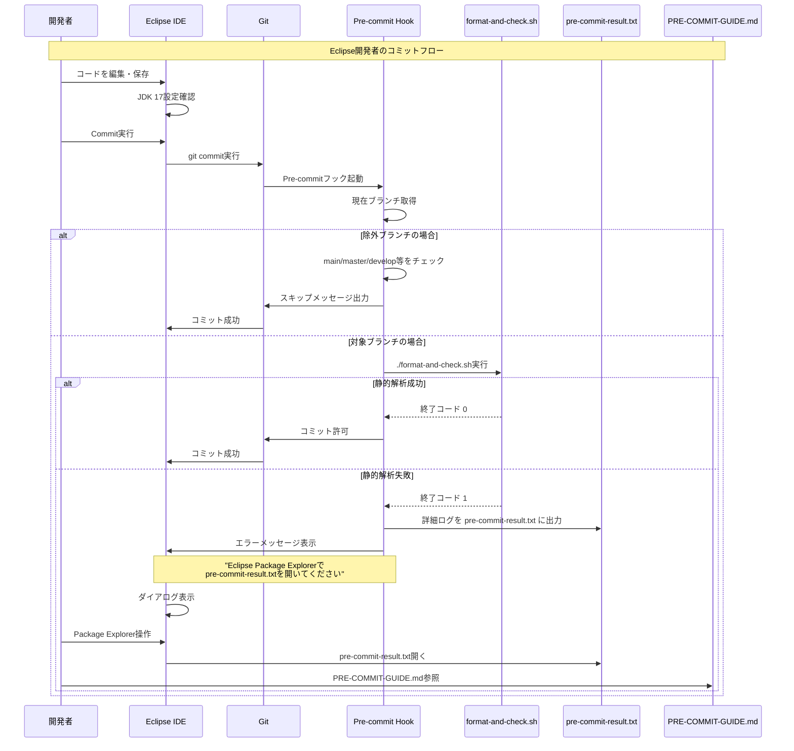

## 2. 統合フォーマット・静的解析フロー（format-and-check.sh）

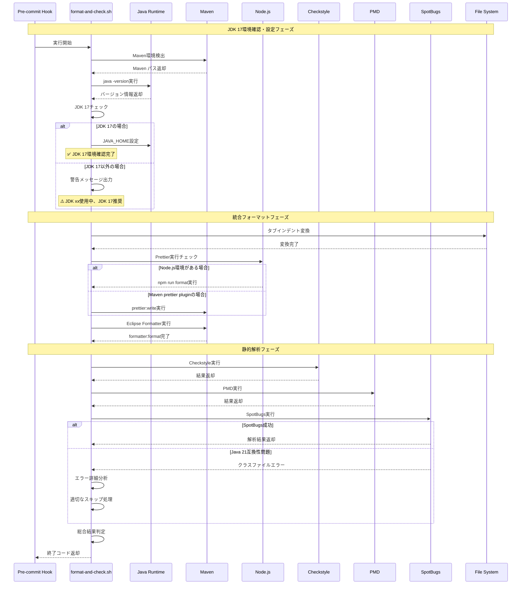

## 3. JDK 17環境強制設定フロー

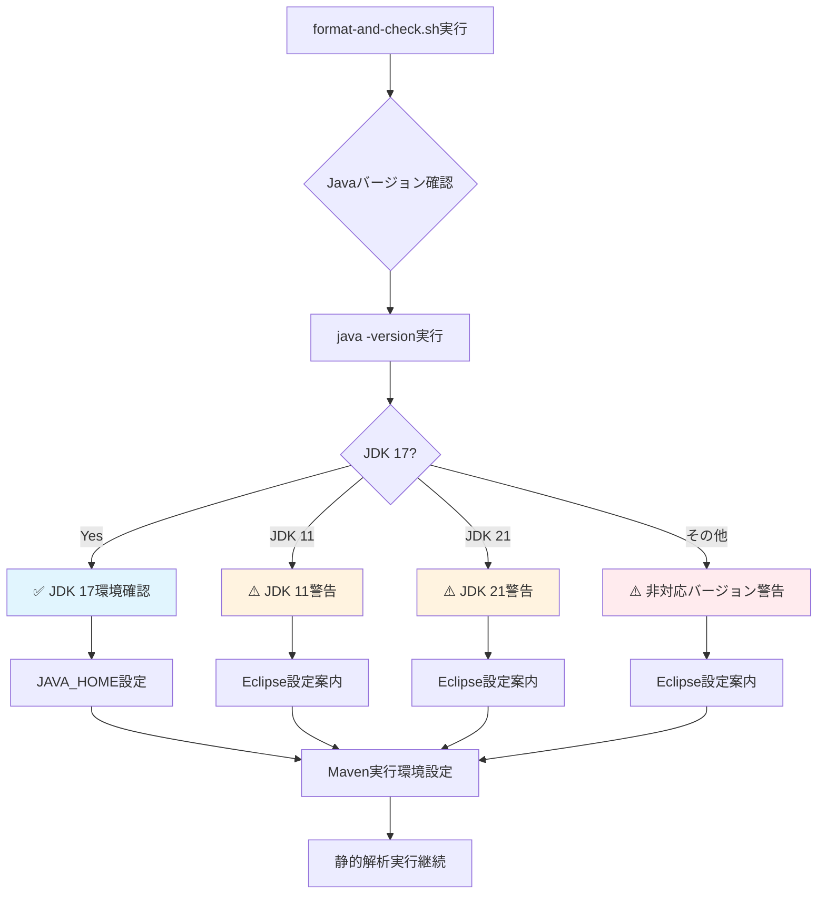

## 4. Eclipse IDE連携フロー

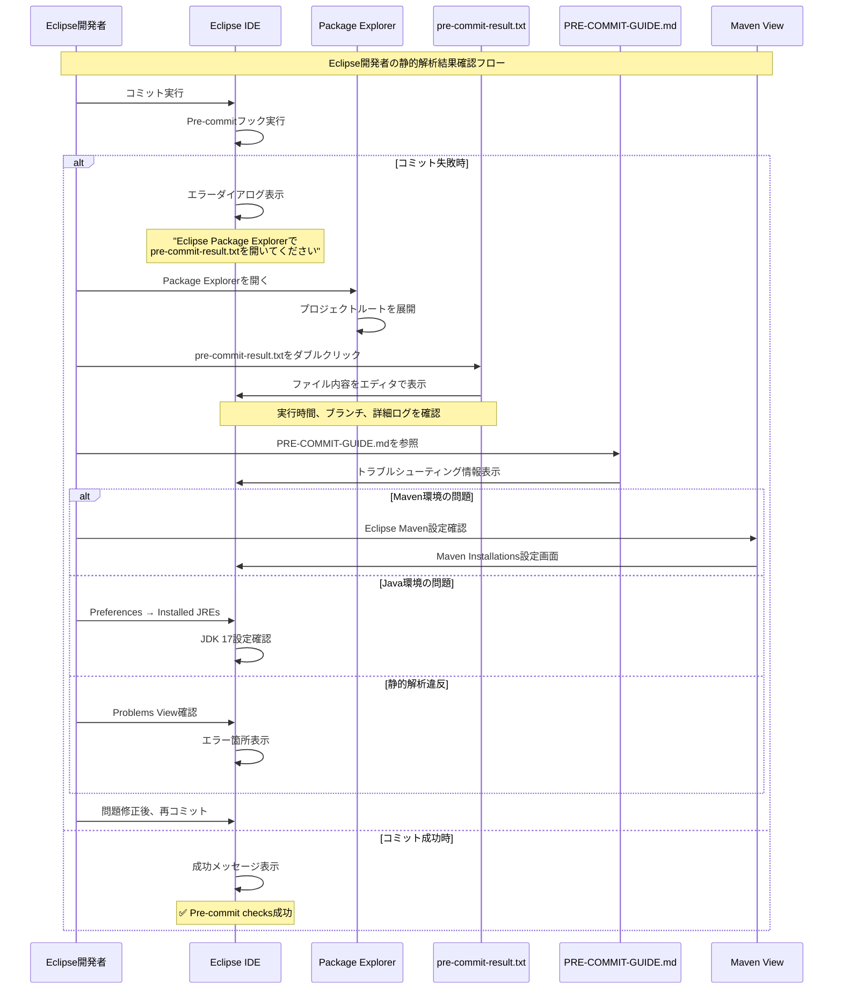

## 5. SpotBugs互換性問題対応フロー

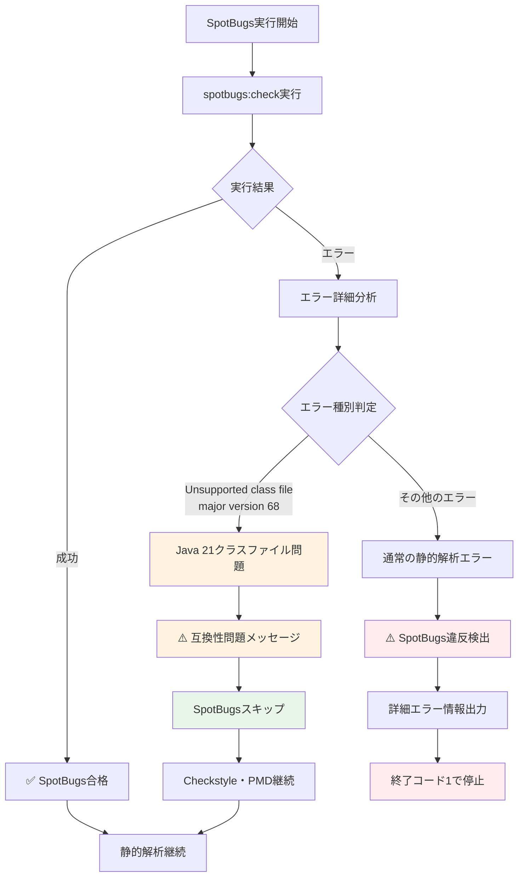

## 6. ブランチ除外フロー

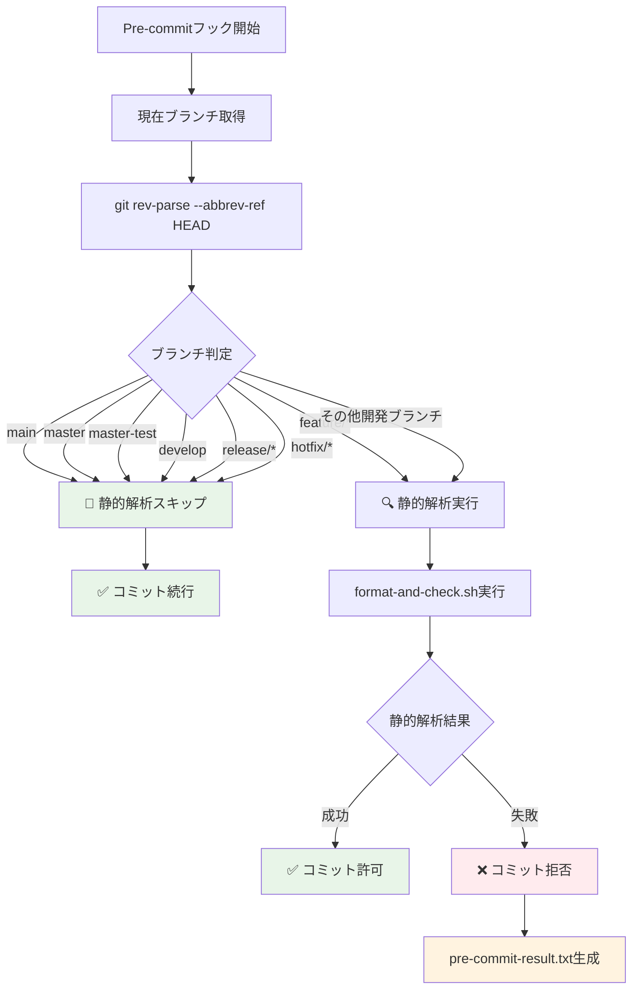

## 7. エラーハンドリング・リカバリーフロー

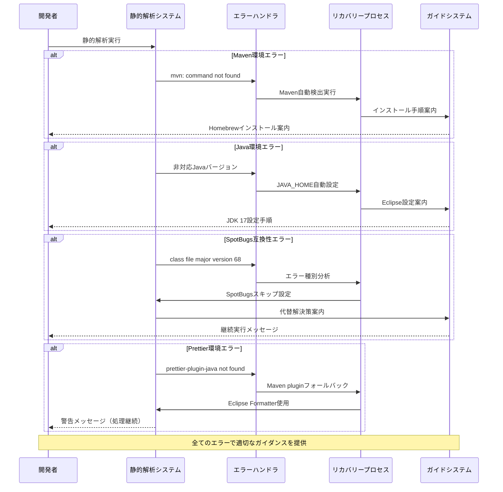

## まとめ

### 主要なフロー
1. **Eclipse中心の開発体験**: ターミナル操作不要
2. **JDK 17環境強制**: プロジェクト要件の確実な適用
3. **柔軟なエラーハンドリング**: 部分的失敗でも処理継続
4. **ブランチベース運用**: 開発ブランチでのみ品質ゲート

### 検出される品質問題
- **Checkstyle**: コーディング規約違反
- **PMD**: 品質問題・複雑度
- **SpotBugs**: バグパターン（Java 17環境）
- **統合フォーマット**: インデント・スタイル統一

### 次のステップ
- IntelliJ IDEA対応の強化
- CI/CDパイプライン統合
- カスタムルール追加
- SonarQube連携検討
        Format->>Format: 統合フォーマット・チェック処理
        Format-->>Script: 完了
        Script->>Dev: 統合実行完了
    else 手動実行選択の場合
        Note over Dev, Files: Phase 3: スペース→タブ変換
        Script->>Dev: Phase 1実行確認
        Dev->>Script: Enter（実行）
        Script->>Files: find + sed によるタブ変換
        Files-->>Script: 変換完了
        
        Note over Dev, Files: Phase 4: Prettier実行（オプション）
        alt Prettier環境が利用可能
            Script->>Dev: Phase 2実行確認
            Dev->>Script: Enter（実行）
            Script->>Node: npm run format
            Node->>Files: Prettier Java フォーマット（タブ設定）
            Files-->>Node: フォーマット完了
            Node-->>Script: 実行結果
        else Prettier環境未設定
            Script->>Dev: Prettier環境未設定のためスキップ
        end
        
        Note over Dev, Files: Phase 5: Eclipse Formatter実行
        Script->>Dev: Phase 3実行確認
        Dev->>Script: Enter（実行）
        Script->>Maven: mvn formatter:format
        Maven->>Java: Eclipse Code Formatter実行
        Java->>Files: eclipse-format.xml使用でタブフォーマット
        Files-->>Java: フォーマット完了
        Java-->>Maven: 実行結果
        Maven-->>Script: フォーマット成功
    end
    Java->>Files: フォーマット状態チェック
    Files-->>Java: フォーマット違反情報
    Java-->>Maven: 違反数・詳細
    Maven-->>Script: 実行結果（exit code）
    Script->>Dev: 結果表示・次フェーズ確認
    
    Note over Dev, Files: Phase 3: 自動フォーマット実行
    Dev->>Script: Enter（実行）
    Script->>Maven: mvn fmt:format
    Maven->>Java: Google Java Format実行
    Java->>Files: ファイル自動修正
    Files-->>Java: 修正完了
    Java-->>Maven: フォーマット済みファイル数
    Maven-->>Script: 実行結果
    Script->>Dev: フォーマット結果表示
    
    Note over Dev, Files: Phase 4: フォーマット差分確認
    Dev->>Script: Enter（実行）
    Script->>Git: git diff --name-only
    Git->>Files: 変更ファイル検索
    Files-->>Git: 変更ファイル一覧
    Git-->>Script: 差分ファイル一覧
    Script->>Dev: 変更ファイル表示
    
    Note over Dev, Files: Phase 5: コンパイルチェック
    Dev->>Script: Enter（実行）
    Script->>Maven: mvn compile -DskipTests -q
    Maven->>Java: Javaコンパイル
    Java->>Files: .classファイル生成
    
    alt Lombokエラーの場合
        Java-->>Maven: コンパイルエラー
        Maven-->>Script: BUILD FAILURE
        Script->>Dev: Lombokエラー表示（予期される）
    else 正常コンパイル
        Files-->>Java: コンパイル完了
        Java-->>Maven: BUILD SUCCESS
        Maven-->>Script: 成功
        Script->>Dev: コンパイル成功表示
    end
    
    Note over Dev, Files: Phase 6: 基本スタイルチェック
    Dev->>Script: Enter（実行）
    Script->>Maven: mvn checkstyle:check -Dcheckstyle.config.location=checkstyle-simple.xml
    Maven->>Java: Checkstyle実行
    Java->>Files: checkstyle-simple.xml読み込み
    Java->>Files: ソースコード解析
    Files-->>Java: 違反情報
    Java-->>Maven: 警告レベル違反
    Maven-->>Script: BUILD SUCCESS（警告のみ）
    Script->>Dev: 警告レベル結果表示
    
    Note over Dev, Files: Phase 7: 厳格スタイルチェック
    Dev->>Script: Enter（実行）
    Script->>Maven: mvn checkstyle:check -Dcheckstyle.config.location=checkstyle-strict.xml
    Maven->>Java: Checkstyle実行
    Java->>Files: checkstyle-strict.xml読み込み
    Java->>Files: ソースコード解析
    Files-->>Java: xxx件の違反検出
    Java-->>Maven: エラーレベル違反
    Maven-->>Script: BUILD FAILURE
    Script->>Dev: xxx違反でビルド失敗表示
    
    Note over Dev, Files: Phase 8: PMD品質チェック
    Dev->>Script: Enter（実行）
    Script->>Maven: mvn pmd:check
    Maven->>Java: PMD実行
    Java->>Files: pmd-basic.xml読み込み
    Java->>Files: ソースコード解析
    Files-->>Java: xxx件の違反検出
    Java-->>Maven: 品質違反情報
    Maven-->>Script: BUILD SUCCESS（failOnViolation=false）
    Script->>Dev: xxx違反検出表示
    
    Note over Dev, Files: Phase 9: SpotBugsバグ検出
    Dev->>Script: Enter（実行）
    Script->>Maven: mvn spotbugs:check
    Maven->>Java: SpotBugs実行
    
    alt コンパイル成功の場合
        Java->>Files: .classファイル解析
        Files-->>Java: 9件のバグパターン検出
        Java-->>Maven: バグ情報
        Maven-->>Script: BUILD FAILURE（failOnError=true）
        Script->>Dev: xxxバグ検出表示
    else コンパイル失敗の場合
        Java-->>Maven: コンパイルエラーで実行不可
        Maven-->>Script: BUILD FAILURE
        Script->>Dev: SpotBugs実行不可表示
    end
    
    Note over Dev, Files: Phase 10: レポート生成
    Dev->>Script: Enter（実行）
    Script->>Maven: mvn checkstyle:checkstyle pmd:pmd spotbugs:spotbugs
    Maven->>Java: レポート生成プロセス
    
    par Checkstyleレポート
        Java->>Files: target/site/checkstyle.html生成
        Java->>Files: target/checkstyle-result.xml生成
    and PMDレポート
        Java->>Files: target/site/pmd.html生成
        Java->>Files: target/pmd.xml生成
    and SpotBugsレポート
        Java->>Files: target/site/spotbugs.html生成
        Java->>Files: target/spotbugsXml.xml生成
    end
    
    Files-->>Java: レポート生成完了
    Java-->>Maven: 生成結果
    Maven-->>Script: レポート生成成功
    
    Note over Dev, Files: Phase 11: レポート確認・Git操作
    Script->>Files: レポートファイル存在確認
    Files-->>Script: 存在状況
    Script->>Dev: レポート一覧表示
    Script->>Dev: Git操作選択プロンプト
    
    alt フォーマット済みファイルステージング
        Dev->>Script: 選択1
        Script->>Git: git add .
        Git->>Files: ステージング実行
        Files-->>Git: ステージング完了
        Git-->>Script: 完了通知
        Script->>Git: git status
        Git-->>Script: ステータス情報
        Script->>Dev: ステージング結果表示
    else テストファイルコミット
        Dev->>Script: 選択2
        Script->>Git: git add . + git commit
        Git->>Files: コミット実行
        Files-->>Git: コミット完了
        Git-->>Script: コミット完了
        Script->>Dev: コミット結果表示
    else スキップ
        Dev->>Script: 選択3
        Script->>Dev: Git操作スキップ
    end
    
    Script->>Dev: 実行完了・参考資料案内
```

## 2. 統合フォーマット実行フロー（format-and-check.sh）

```mermaid
sequenceDiagram
    participant Dev as 開発者
    participant Script as format-and-check.sh
    participant Maven as Maven
    participant Node as Node.js/Prettier
    participant Java as Java/JVM
    participant Files as ファイルシステム
    participant Reports as レポート
    participant Git as Git
    
    Note over Dev, Reports: 🚀 統合フォーマット・チェック開始
    Dev->>Script: ./format-and-check.sh 実行
    Script->>Dev: 🎯 統合フォーマット・品質チェック開始
    
    Note over Script, Reports: Phase 1: 環境確認・セットアップ
    Script->>Files: Projectディレクトリ存在確認
    Files-->>Script: ディレクトリ確認完了
    Script->>Files: pom.xml, package.json, .prettierrc, eclipse-format.xml存在確認
    Files-->>Script: 設定ファイル確認結果
    Script->>Java: Java環境確認
    Java-->>Script: Java 17.0.9 LTS確認
    Script->>Maven: Maven環境確認
    Maven-->>Script: Apache Maven 3.9.x確認
    Script->>Dev: 🔧 環境確認完了 - すべての設定ファイルが存在
    
    Note over Script, Reports: Phase 2: バックアップ＆スペース→タブ変換
    Script->>Files: 変更前バックアップ作成
    Files-->>Script: バックアップ完了
    Script->>Files: find src/main/java -name "*.java" -type f
    Files-->>Script: xxx個のJavaファイル検出
    
    loop 各Javaファイル
        Script->>Files: sed 's/    /\t/g' (4スペース→タブ)
        Files-->>Script: ファイル変換完了
    end
    
    Script->>Dev: ✅ Step 1: タブ変換完了 (47ファイル処理)
    
    Note over Script, Reports: Phase 3: Prettier Java実行
    alt package.json & .prettierrcが存在
        Script->>Node: npm run format (prettier-plugin-java)
        Note over Node, Files: .prettierrc設定: useTabs=true, tabWidth=4
        Node->>Files: prettier --write "src/**/*.java"
        Files->>Files: Prettier+Java plugin適用
        Files-->>Node: フォーマット完了
        Node-->>Script: Prettier実行成功
        Script->>Dev: ✅ Step 2: Prettier Java フォーマット完了
    else Node.js/Prettier環境未設定
        Script->>Dev: ⚠️ Step 2: Prettier環境未設定 - スキップ
    end
    
    Note over Script, Reports: Phase 4: Eclipse Code Formatter実行
    Script->>Maven: mvn net.revelc.code.formatter:formatter-maven-plugin:format -q
    Maven->>Java: Eclipse Code Formatter plugin実行
    Note over Java, Files: eclipse-format.xml設定: tab_char=tab, tab_size=4
    Java->>Files: Eclipse formatter rules適用
    Files-->>Java: フォーマット適用完了
    Java-->>Maven: BUILD SUCCESS
    Maven-->>Script: Eclipse Formatter実行完了
    Script->>Dev: ✅ Step 3: Eclipse Code Formatter完了
    
    Note over Script, Reports: Phase 5: フォーマット検証
    Script->>Maven: mvn net.revelc.code.formatter:formatter-maven-plugin:validate
    Maven->>Java: フォーマット状態チェック
    Java->>Files: フォーマット差分確認
    Files-->>Java: フォーマット状態返却
    Java-->>Maven: 検証結果
    Maven-->>Script: フォーマット検証完了
    Script->>Dev: 🔍 Step 4: フォーマット検証完了
    
    Note over Script, Reports: Phase 6: 静的解析実行（並列）
    Script->>Dev: 🚀 静的解析開始...
    
    par Checkstyle Simple
        Script->>Maven: mvn checkstyle:check -Dcheckstyle.config.location=checkstyle-simple.xml -q
        Maven->>Java: Checkstyle basic rules実行
        Java->>Files: 構文・スタイルチェック
        Files-->>Java: 違反情報検出
        Java-->>Maven: 結果（警告レベル多数）
        Maven-->>Script: BUILD SUCCESS (警告のみ)
    and PMD品質チェック
        Script->>Maven: mvn pmd:check -q
        Maven->>Java: PMD code quality analysis実行
        Java->>Files: コード品質分析
        Files-->>Java: xxx件の品質問題検出
        Java-->>Maven: BUILD FAILURE (failOnViolation=false)
        Maven-->>Script: PMD: xxx件違反検出
    and SpotBugsバグ検出
        Script->>Maven: mvn compile spotbugs:check -q
        Maven->>Java: SpotBugs bytecode analysis実行
        Java->>Files: バイトコード解析
        Files-->>Java: xxx件のバグパターン検出
        Java-->>Maven: BUILD FAILURE (xxx bugs found)
        Maven-->>Script: SpotBugs: xxx件バグ検出
    end
    
    Note over Script, Reports: Phase 7: レポート生成
    Script->>Maven: mvn checkstyle:checkstyle pmd:pmd spotbugs:spotbugs -q
    Maven->>Java: 全ツールレポート生成
    
    par Checkstyleレポート
        Java->>Files: target/site/checkstyle.html生成
    and PMDレポート  
        Java->>Files: target/site/pmd.html生成
    and SpotBugsレポート
        Java->>Files: target/site/spotbugs.html生成
    end
    
    Files-->>Java: レポート生成完了
    Java-->>Maven: BUILD SUCCESS
    Maven-->>Script: レポート生成完了
    
    Note over Script, Reports: Phase 8: Git差分確認
    Script->>Git: git diff --name-only
    Git->>Files: 変更ファイル検索
    Files-->>Git: 変更されたJavaファイル一覧
    Git-->>Script: 差分ファイル情報
    
    Note over Script, Reports: Phase 9: 結果サマリー＆表示
    Script->>Script: 実行結果集計・分析
    Script->>Files: レポートファイル存在確認
    Files-->>Script: HTMLレポート確認完了
    
    Script->>Dev: 📊 ═══ 実行結果サマリー ═══
    Script->>Dev: ✅ タブ変換: xxxファイル処理完了
    Script->>Dev: ✅ Prettier Java: フォーマット適用
    Script->>Dev: ✅ Eclipse Formatter: 統一スタイル適用
    Script->>Dev: ⚠️ 品質チェック結果:
    Script->>Dev:     - PMD: xxx件の品質問題
    Script->>Dev:     - SpotBugs: xxx件のバグパターン
    Script->>Dev: 📁 詳細レポート: target/site/*.html
    Script->>Dev: 🔗 統合設定ファイル:
    Script->>Dev:     - .prettierrc (Prettier+Java設定)
    Script->>Dev:     - eclipse-format.xml (Eclipse設定)
    Script->>Dev:     - pom.xml (Maven plugin設定)
    Script->>Dev: 💡 Tips: VS Code使用時は Prettier拡張を有効化
    Script->>Dev: 🎉 統合フォーマット・品質チェック完了
```

## 3. CI/CD自動実行フロー（GitHub Actions）

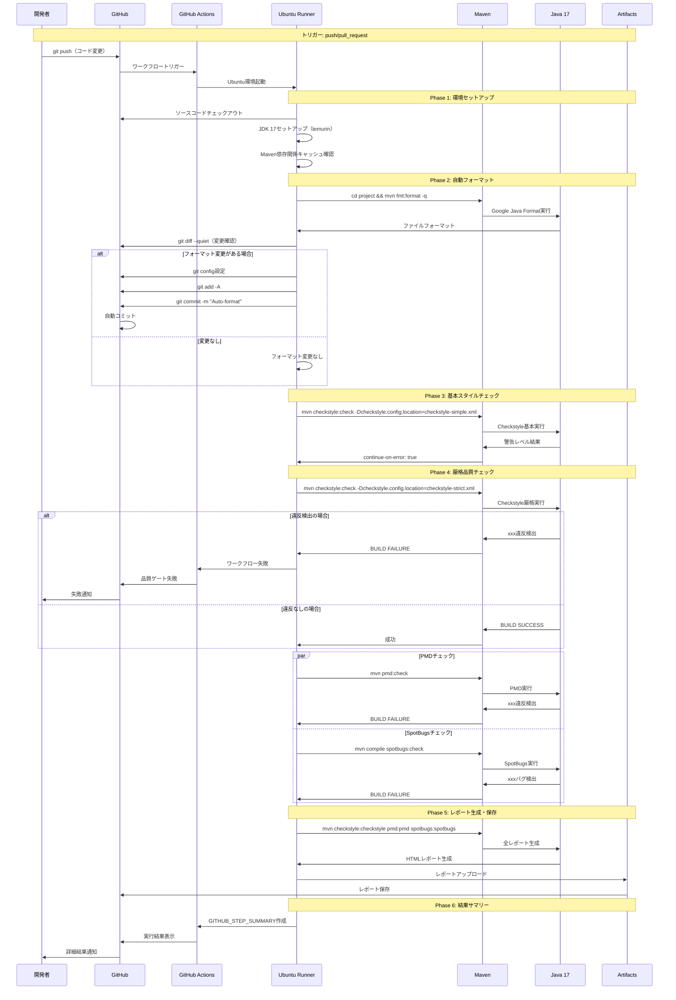

## 3. Pre-commitフック実行フロー

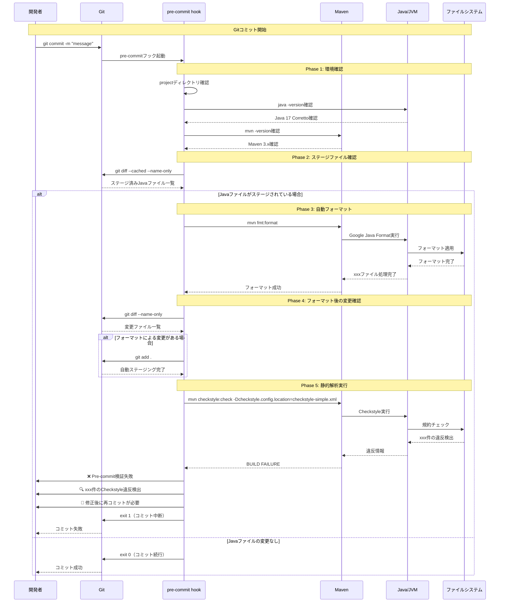

## 4. GitHub Actions CI/CDフロー

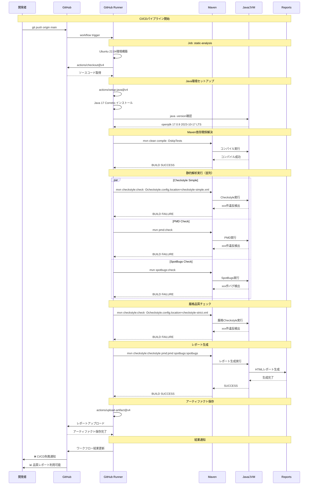

## 5. 統合テストフロー（comprehensive-integration-test.sh）

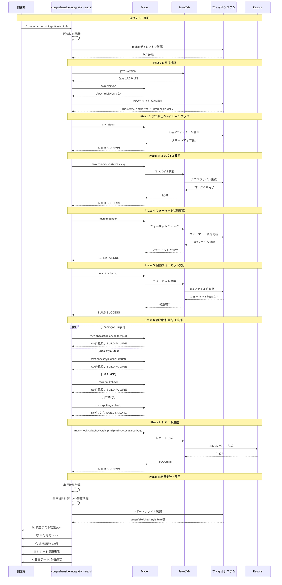

## 6. エラーハンドリングフロー

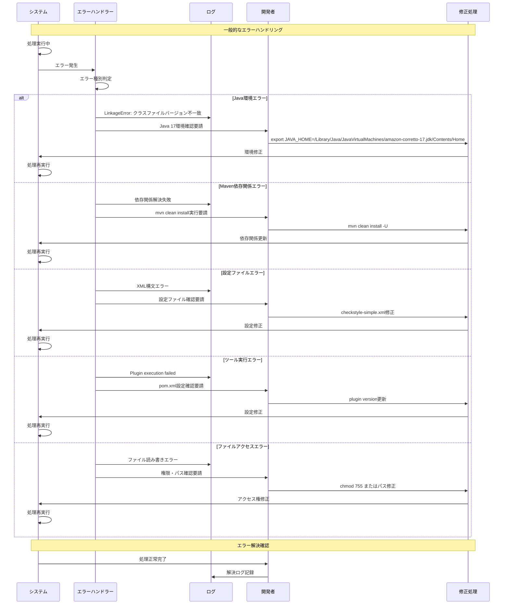

## 7. ツール間連携フロー

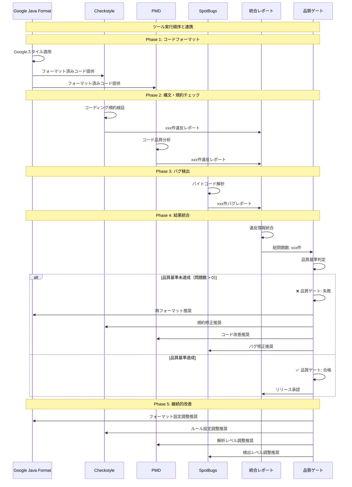

## まとめ

この包括的なシーケンス図は、プロジェクトにおける静的解析ツールの完全な動作フローを表現しています。

### 主要なフロー
1. **手動実行**: 開発者による対話式実行
2. **Pre-commit**: Git コミット時の自動チェック  
3. **CI/CD**: GitHub Actions による継続的品質管理
4. **統合テスト**: 包括的な品質検証
5. **エラーハンドリング**: 問題発生時の対応手順
6. **ツール間連携**: 各ツールの協調動作

### 検出される品質問題
- **Checkstyle**: xxx件のコーディング規約違反
- **PMD**: xxx件のコード品質問題  
- **SpotBugs**: xxx件の潜在的バグ
- **総計**: xxx件の改善すべき問題

### 次のステップ
1. 段階的な品質改善計画の実行
2. チーム固有ルールの追加
3. 継続的な設定最適化
4. 品質メトリクスの定期的な見直し
