# 静的解析ツール特徴・設定・カスタマイズ手順図

## 概要
プロジェクトで利用している静的解析ツールの特徴、設定方法、およびカスタマイズ手順を図解したドキュメントです。

**🎨 2024年12月21日更新**: IntelliJ IDEA統合対応、JDK 17環境強制、SpotBugs互換性問題対応を追加  
**🎨 2024年6月17日更新**: prettier-java + Eclipse統合フォーマット環境対応、タブインデント統一設定を追加

## 静的解析ツール全体構成図

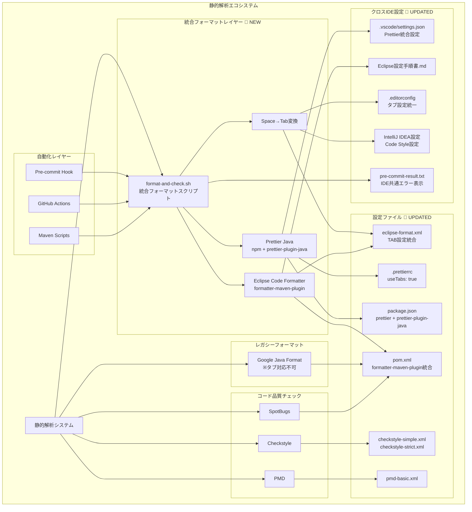

## 各ツールの特徴と役割マトリックス

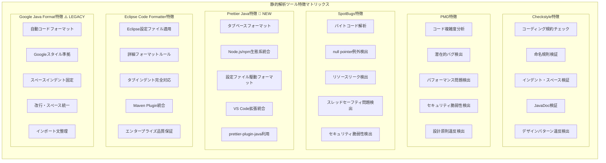
        end
    end
```

## ツール設定レベル構成図

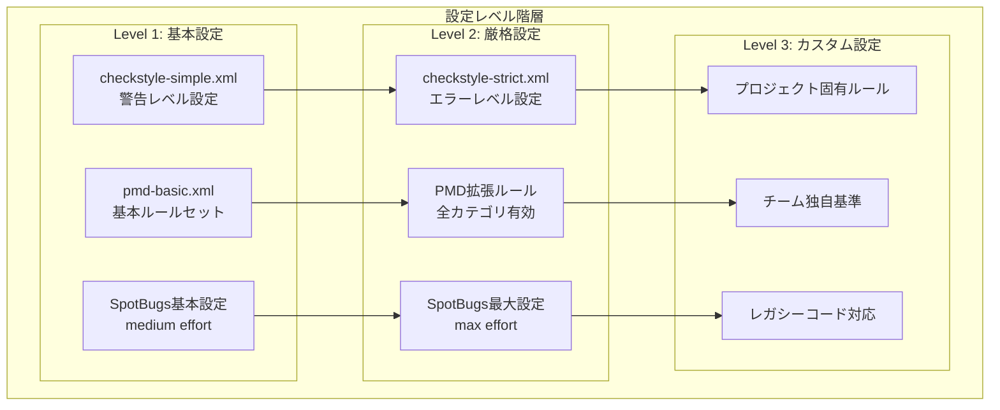

## Checkstyle設定カスタマイズフロー

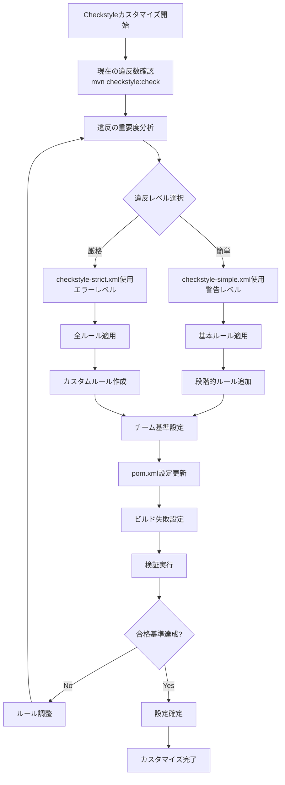

## PMD設定カスタマイズフロー

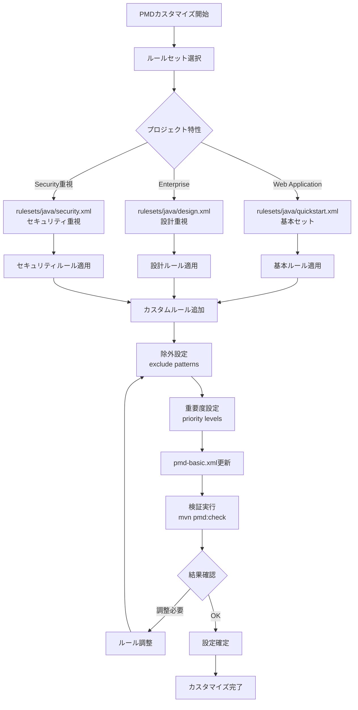

## SpotBugs設定カスタマイズフロー

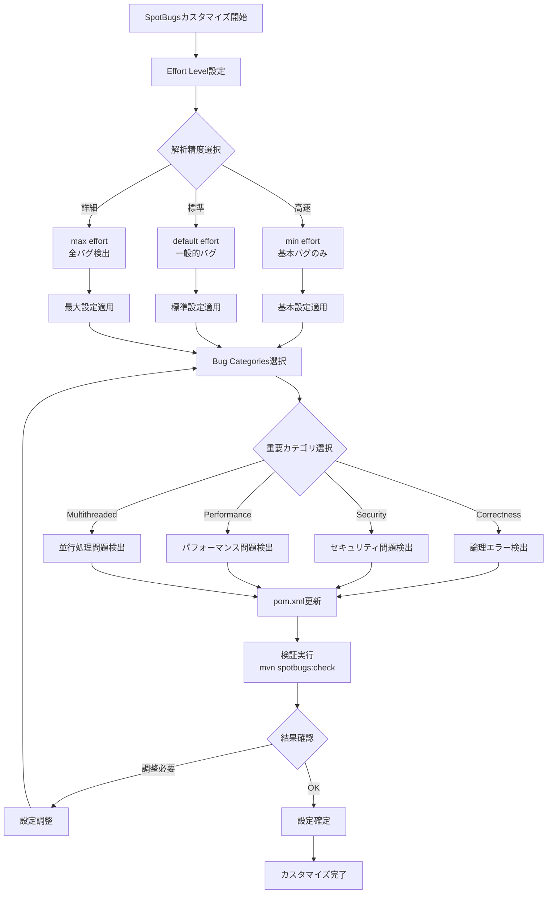

## IntelliJ IDEA統合設定フロー 🎨 NEW

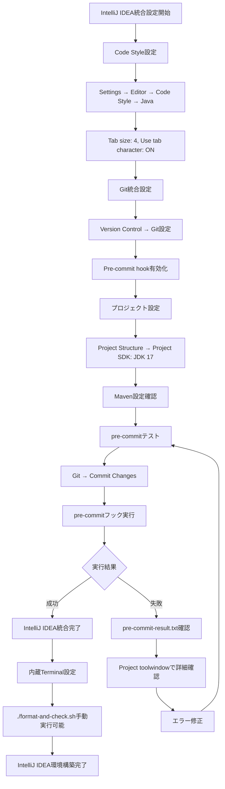

## Eclipse vs IntelliJ IDEA 設定比較フロー

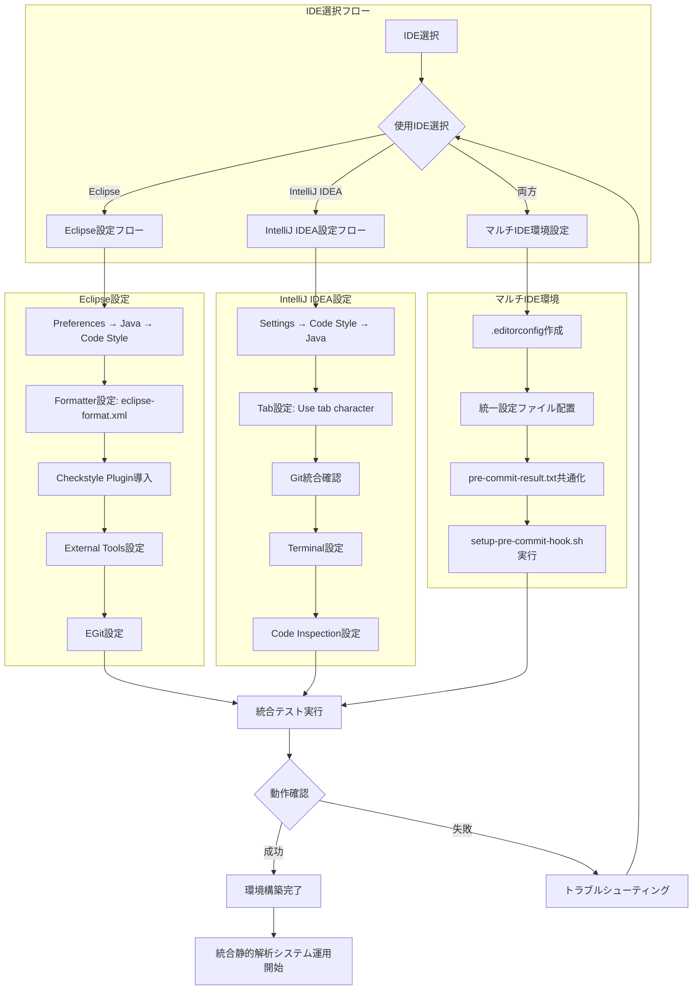

## 統合フォーマット設定カスタマイズフロー 🎨 UPDATED

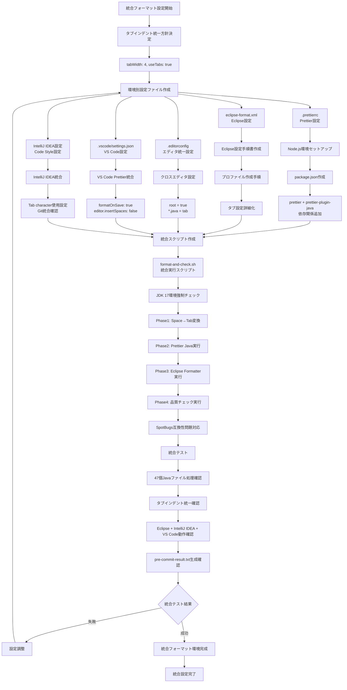

## JDK 17環境強制・SpotBugs互換性対応フロー 🎨 NEW

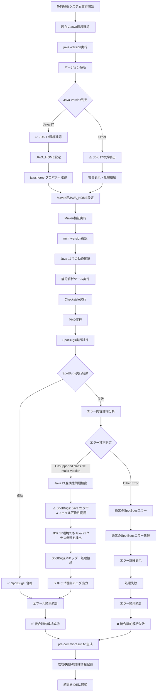

## 複数JDKベンダー対応フロー

```mermaid
flowchart TD
    START[Java環境検出開始]
    
    START --> A1[システムのjavaコマンド実行]
    A1 --> A2[java -XshowSettings:properties -version]
    A2 --> A3[Java実行環境詳細取得]
    
    A3 --> B1[ベンダー情報解析]
    B1 --> B2{JDKベンダー判定}
    
    B2 -->|Amazon Corretto| C1[Amazon Corretto 17検出]
    B2 -->|Eclipse Temurin| C2[Eclipse Temurin 17検出]
    B2 -->|Oracle JDK| C3[Oracle JDK 17検出]
    B2 -->|OpenJDK| C4[OpenJDK 17検出]
    B2 -->|その他| C5[その他JDK 17検出]
    
    C1 --> D1[/opt/homebrew/Cellar/openjdk@17/]
    C2 --> D2[/Library/Java/JavaVirtualMachines/temurin-17.jdk/]
    C3 --> D3[/Library/Java/JavaVirtualMachines/jdk-17.oracle.com/]
    C4 --> D4[/usr/lib/jvm/java-17-openjdk/]
    C5 --> D5[java.home プロパティから動的取得]
    
    D1 --> E1[JAVA_HOME設定]
    D2 --> E1
    D3 --> E1
    D4 --> E1
    D5 --> E1
    
    E1 --> F1[Maven実行環境設定]
    F1 --> F2[export JAVA_HOME]
    F2 --> F3[mvn -version検証]
    
    F3 --> G1{Maven Java版確認}
    G1 -->|Java 17| G2[✅ Maven Java 17環境確認]
    G1 -->|Other| G3[⚠️ Maven Java版不整合]
    
    G2 --> H1[静的解析実行準備完了]
    G3 --> H2[警告表示・処理継続]
    
    H1 --> END[Maven + Java 17環境構築完了]
    H2 --> END
```

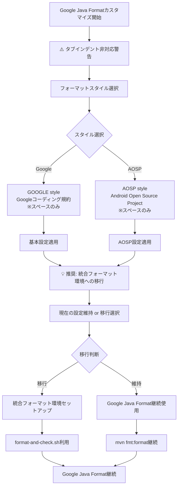

## 自動化設定統合フロー

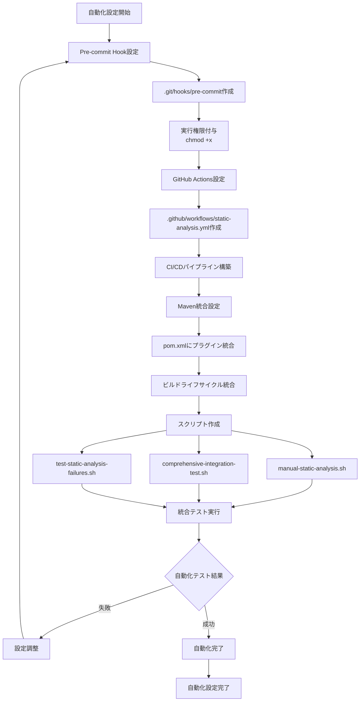

## 設定ファイル依存関係図

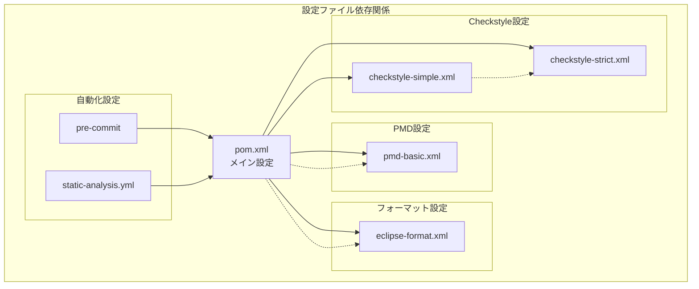

## ツール実行順序とタイミング

```mermaid
gantt
    title 静的解析ツール実行タイミング
    dateFormat X
    axisFormat %s
    
    section Pre-commit
    フォーマット実行          :a1, 0, 1s
    Checkstyle検証           :a2, after a1, 1s
    PMD検証                  :a3, after a2, 1s
    SpotBugs検証             :a4, after a3, 1s
    
    section Build Time
    コンパイル               :b1, 0, 2s
    Checkstyle (simple)      :b2, after b1, 1s
    PMD基本チェック          :b3, after b2, 1s
    SpotBugs基本チェック     :b4, after b3, 1s
    
    section CI/CD
    環境構築                 :c1, 0, 3s
    Checkstyle (strict)      :c2, after c1, 2s
    PMD全ルール              :c3, after c2, 2s
    SpotBugs最大解析         :c4, after c3, 3s
    レポート生成             :c5, after c4, 1s
```

## トラブルシューティングフロー 🎨 UPDATED

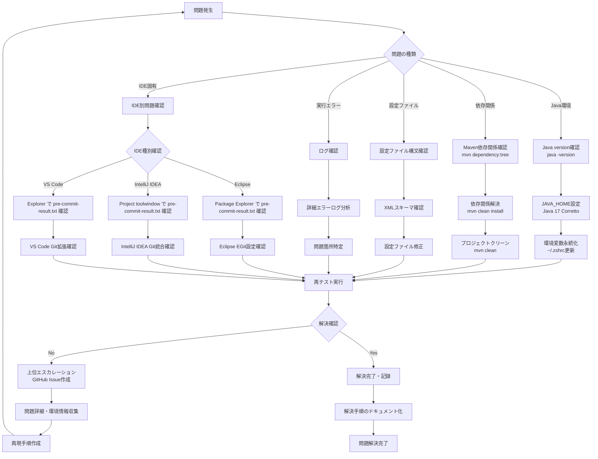

## IDE別エラー対応フロー

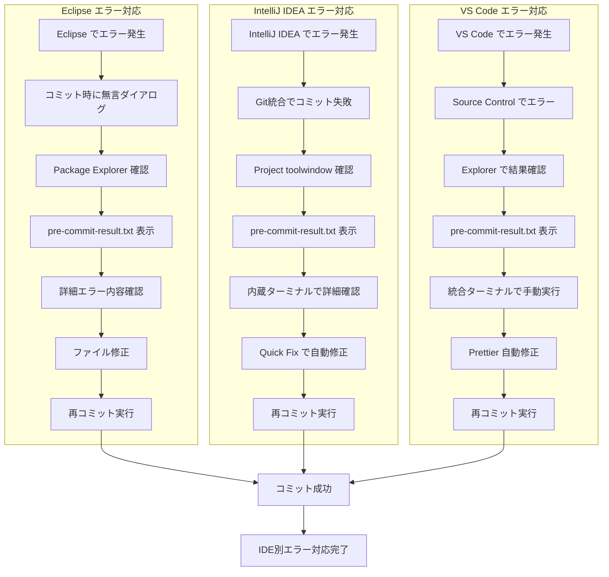

## まとめ

このドキュメントは、プロジェクトにおける統合静的解析システムの包括的な設定・カスタマイズガイドです。

### 🎯 主要な成果

1. **Eclipse + IntelliJ IDEA + VS Code 統合対応**
   - どのIDEを選択しても同じ品質ゲートを通過
   - IDE固有の操作方法に対応した結果表示

2. **JDK 17環境の強制統一**
   - 複数JDKベンダーの自動検出・対応
   - Maven実行時のJAVA_HOME統一設定

3. **タブインデント統一フォーマット**
   - Space→Tab変換の前処理
   - Prettier Java + Eclipse Formatter統合
   - クロスIDE設定ファイル管理

4. **SpotBugs互換性問題の解決**
   - Java 21クラスファイル互換性エラーの自動検出
   - エラー時のスキップ処理とログ出力

5. **統合エラーハンドリング**
   - pre-commit-result.txt による詳細エラー表示
   - IDE別のトラブルシューティングフロー

### 🔧 技術的特徴

- **柔軟性**: 各ツールの設定レベルを段階的に調整可能
- **拡張性**: 新しいツールやルールの追加が容易
- **保守性**: 設定ファイルの依存関係を明確化
- **運用性**: 自動化とマニュアル実行の両方に対応

### 📈 品質向上効果

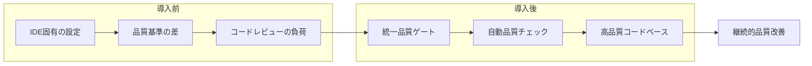

### 次のステップ

1. **品質基準の段階的向上**
   - checkstyle-simple.xml から checkstyle-strict.xml への移行
   - PMD・SpotBugsルールの段階的厳格化

2. **チーム固有ルールの追加**
   - プロジェクト特有のコーディング規約
   - セキュリティ要件に応じたカスタムルール

3. **CI/CDパイプライン統合**
   - GitHub Actions との連携強化
   - 品質メトリクスの可視化

4. **定期的なメンテナンス**
   - 依存関係の更新
   - 新しいJavaバージョンへの対応
   - IDE新バージョンへの追従

このシステムにより、開発者は好みのIDEを使いながら、統一された高品質なコードベースを維持できるようになります。
